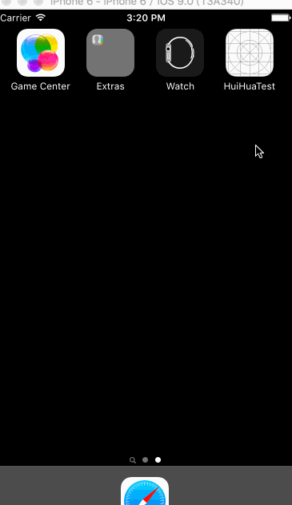

# CrView
###Example

######核心代码
    CGFloat radius = self.bounds.size.width / 2;
    _cashapelayer = [self createRingLayerWithCenter:CGPointMake(radius, radius) radius:radius * 7 / 8 - 2 lineWidth:radius / 8 color:color];
    _cashapelayer.strokeStart = start;
    _cashapelayer.strokeEnd = end;
    [self.layer addSublayer:_cashapelayer];